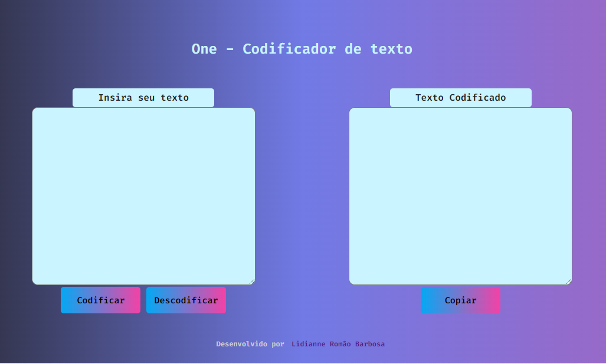
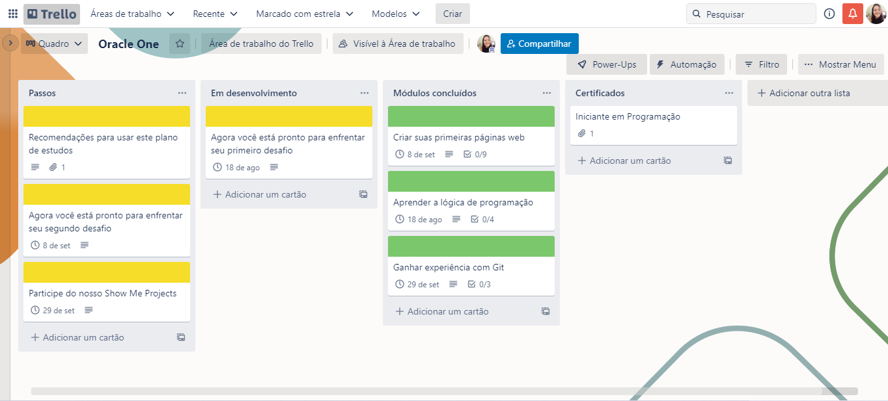

# Decodificador de Texto

## Índice

- [1. Status do projeto](#1-status-do-projeto)
- [2. Acesso](#2-acesso)
- [3. Descrição](#3-descricao)
- [4. Planejamento](#4-planejamento)
- [5. Tecnologias utilizadas](#8-tecnologias-utilizadas)
- [6. Pessoas desenvolvedoras](#9-pessoas-desenvolvedoras)

## 1. Status do projeto

-  

## 2. Acesso

O deploy do projeto foi realizado pelo Git Pages. [Clique aqui](https://lidiannerb.github.io/Challenge-Oracle-One/) para acessá-lo.

### Como usar
Você precisará:

- Ter o Node.js instalado no seu pc 
- Clonar o projeto.
- Instalar as dependências: npm install
- Iniciar a aplicação: npm start

## 3. Descrição
 
O desafio foi criar uma aplicação que criptografa textos. 

Você poderá utilizar essa ferramenta para trocar mensagens secretas com outras pessoas que saibam o segredo da criptografia utilizada.

As "chaves" de criptografia que utilizaremos foram:
A letra "e" é convertida para "enter"
A letra "i" é convertida para "imes"
A letra "a" é convertida para "ai"
A letra "o" é convertida para "ober"
A letra "u" é convertida para "ufat"

Requisitos:
- Deve funcionar apenas com letras minúsculas
- Não devem ser utilizados letras com acentos nem caracteres especiais
- Deve ser possível converter uma palavra para a versão criptografada e também retornar uma palavra criptografada para a versão original.

Por exemplo:
"gato" => "gaitober"
gaitober" => "gato"

A página deve ter campos para inserção do texto a ser criptografado ou descriptografado, e a pessoa usuária deve poder escolher entre as duas opções
O resultado deve ser exibido na tela.

Extra:
- Um botão que copie o texto criptografado/descriptografado para a área de transferência - ou seja, que tenha a mesma funcionalidade do ctrl+C ou da opção "copiar" do menu dos aplicativos.
## 4. Planejamento

Fizemos o planejamento de estudos do curso no Trello.

## 5. Tecnologias utilizadas

- Javascript
- HTML 5
- CSS
- Node.JS

## 6. Pessoas desenvolvedoras

Este projeto foi desenvolvido durante o Bootcamp da Laboratória, Turma 007 pelas colaboradoras: 

- [Lidianne Barbosa](https://www.linkedin.com/in/lromao/)

.jpg)
